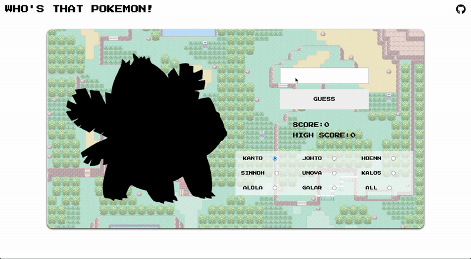

# Who's That Pokemon?
This will take everyone back to the good old days, the 90s. I wanted to create something using the pokeapi.co API, so I made a game to test your Pokemon knowledge. Chose your favorite generation, start guessing Pokemon, and get a high score!

[Click here](https://whosthatpokemonhw.netlify.app/) to test your Pokemon knowledge.

## How It's Made:

**Tech used:** HTML, CSS, JavaScript

The Pokemon are pulled from the pokeapi.co API randomly and by selected generation. The silhouette is just some simple css.

## Lessons Learned:

I really got a chance to see the power of using a framework like Bootstrap and how it can really put a nice touch to a site. There were some tricky little bumps along the way in regards of gathering the correct card prices from the API to ensure all prices searched on ebay were the correct type.

I wanted to make a game that utilized local storage to learn more about it and so users could come back and try and beat their previous high score. This project was also good help with bolstering my API familiarity. 